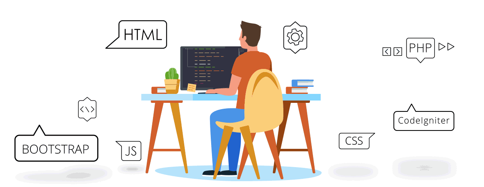

  

 

<h3 align="center"> Explore My Work</h3>

  

  
  
  
  

  

## About Me

  

Passionate Computer Science Engineering student focused on building highly scalable full-stack applications, interactive algorithm visualizers, and AI-powered systems. I aim to create performant, visually stunning, and robust software solutions suitable for modern enterprise and research environments.

* ** Current Focus:** Scalable web architectures, interactive visualizers, and Backend Engineering.
* ** Learning:** Advanced System Design, Cloud Architecture, and Deep Learning (TensorFlow/ResNet50).
* ** Goal:** To build performant, highly robust, and elegant software solutions.

 

## Tech Stack

<table align="center" width="100%" border="0">
  <tr align="center">
    <td width="33%"><b>Languages</b></td>
    <td width="33%"><b>Frontend</b></td>
    <td width="34%"><b>Backend & Database</b></td>
  </tr>
  <tr align="center">
    <td>
       
      <b>Currently Learning:</b> TypeScript
    </td>
    <td>
       
      <b>Currently Learning:</b> React
    </td>
    <td>
       
      <b>Technologies:</b> JDBC 
      <b>Currently Learning:</b> Spring Boot
    </td>
  </tr>

  <tr align="center">
    <td><b>AI & Machine Learning</b></td>
    <td><b>Developer Tools</b></td>
    <td><b>Cloud & Operating Systems</b></td>
  </tr>
  <tr align="center">
    <td>
       
      <b>Currently Learning:</b> Prompt Engineering
    </td>
    <td>
       
      <b>Currently Learning:</b> Postman
    </td>
    <td>
       
      <b>Currently Learning:</b> Azure
    </td>
  </tr>
</table>

 

## Featured Projects

<table border="1" bordercolor="#38BDF8" width="100%" style="border-collapse: collapse;">
  <tr>
    <td width="40%" align="center" valign="middle">
      
    </td>
    <td width="60%" valign="top">
      <h3> AlgoNova – Advanced DSA Visualization</h3>
      
A premium interactive visualization platform that helps students understand complex algorithms and data structures through live animations.

      <b>Features:</b>
      <ul>
        <li>Interactive Sorting, Searching, Trees, Graphs, DP.</li>
        <li>Pathfinding & CPU Scheduling Simulators.</li>
        <li>Full Stack Authentication & Admin/User Dashboards.</li>
      </ul>
      <b>Stack:</b>    
      
      <!--  -->
    </td>
  </tr>
</table>

 

<table border="1" bordercolor="#38BDF8" width="100%" style="border-collapse: collapse;">
  <tr>
    <td width="60%" valign="top">
      <h3> Brain Tumor Classification using ResNet50</h3>
      
An AI-powered system designed to classify abnormal brain tumors from MRI scans using the ResNet50 deep learning architecture.

      <b>Highlights:</b>
      <ul>
        <li>Published IEEE Research Paper.</li>
        <li>High accuracy medical image classification.</li>
        <li>Utilized TensorFlow and CNN architectures.</li>
      </ul>
      <b>Stack:</b>    
      <!--  -->
      
    </td>
    <td width="40%" align="center" valign="middle">
      
    </td>
  </tr>
</table>

 

<table border="1" bordercolor="#38BDF8" width="100%" style="border-collapse: collapse;">
  <tr>
    <td width="40%" align="center" valign="middle">
      
    </td>
    <td width="60%" valign="top">
      <h3> Portfolio Website & Microservices</h3>
      
Modern, responsive, and animated personal portfolio website. Serves as the central hub for my projects, including integrated Java Spring Boot microservices and REST APIs.

      <b>Stack:</b>    
      
      
    </td>
  </tr>
</table>

 

## GitHub Analytics

 <!--  -->

    

  

